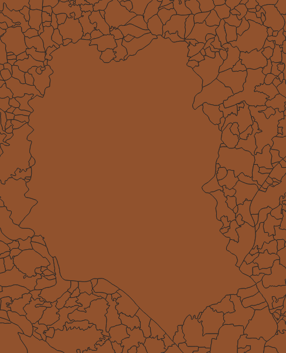
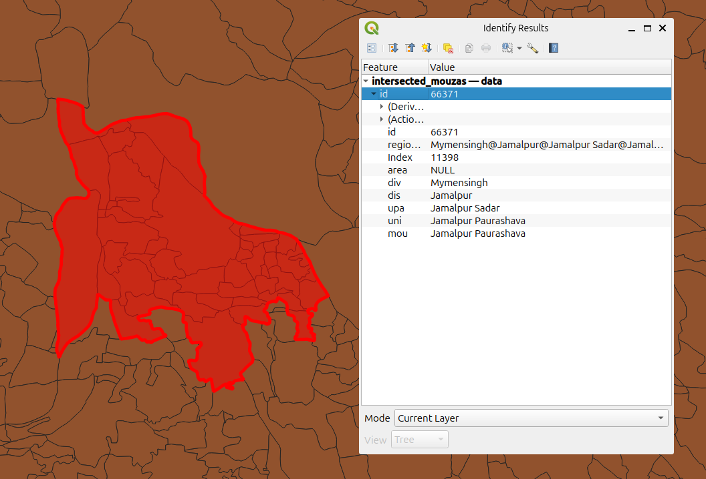

# Model6

## How to run the model and generate estimates

poetry install
poetry run python main.py

## How to upload model estimates to google cloud

- how to login to google cloud
- how to switch to project model6 storage
gsutil -m rsync -r model/ gs://iarsenic-model6

## How does this model differ from model5

### Dropdown Data 

In model6, the dropdown data is created from the geodata. This ensures that we
produce predictions for every area in Bangladesh.

Previous models used the training data to produce dropdown data, 
this however, excluded regions not included in the training data meaning it
was impossible to select many regions in the region selector.

### Switch to python

## Geodata preprocessing

### Regions larger than parent are split

Where a region exceeds the size of its parent region, it is 
split by the borders of its parent regions. This ensures
that each region is entirely contained by its parent.

This is best shown with the Dhaka region. When in the Dhaka
mouza, you could be in several union regions. Splitting the
Dhaka mouza into multiple regions based on the border of 
its parent union region ensures that for any union within Dhaka,
predictions can be generated.

#### Dhaka before split

#### Dhake after split

If a region has no parent after being split, it is removed.

See the example below where the cleaned geodata is overlayed in green. The
red selected region shows an example region that is not entirely contained
within a parent region, even after splitting.

This does mean that areas where the region was removed cannot
be selected for prediction generation. While this is a problem,
we have no way of producing predictions for these regions anyway
because a region requires a parent to be selected.

#### Parentless region before removal

#### Data after parentless region removal

### Parent regions are determined by containing region

Child region labels are overwritten by their geographic parent region,
elminating the possbility of a region's parent label not matching
its geographic parent.

### Regions with missing data labels inheret label from parent

Some mouzas do not have a mouza name, this is often the case
with Paurashava regions. In this case, the mouza name is taken
from the union name of the parent union.

### Regions with matching names are merged

Inhereting union names cant result in duplicate region names. This 
often happens with mouzas within Paurashavas. In this case the 
regions with duplicate names is merged into a single region.

#### Paurashava with duplicate names in child mouzas 

#### Mouzas with duplicate names merged

## Generating model data

## Producing an estimate
